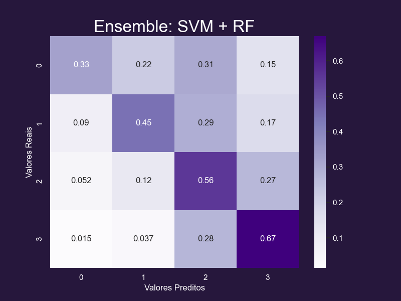

<!-- Improved compatibility of back to top link: See: https://github.com/othneildrew/Best-README-Template/pull/73 -->
<a name="readme-top"></a>
<!--
*** Thanks for checking out the Best-README-Template. If you have a suggestion
*** that would make this better, please fork the repo and create a pull request
*** or simply open an issue with the tag "enhancement".
*** Don't forget to give the project a star!
*** Thanks again! Now go create something AMAZING! :D
-->


<!-- PROJECT SHIELDS -->
<!--
*** I'm using markdown "reference style" links for readability.
*** Reference links are enclosed in brackets [ ] instead of parentheses ( ).
*** See the bottom of this document for the declaration of the reference variables
*** for contributors-url, forks-url, etc. This is an optional, concise syntax you may use.
*** https://www.markdownguide.org/basic-syntax/#reference-style-links
-->


<!-- PROJECT LOGO -->
<br />
<div align="center">
  <a href="https://github.com/github_username/repo_name">
    
  </a>

<h3 align="center">Exercício Programa de PLN</h3>

  <p align="center">
    👶👧👦 Desvendando padrões na escrita das pessoas, <br />
    descobrindo a faixa etária da pessoa apenas pelo seu texto 👨👩👴
    <br />
    <br />
    <a href="https://github.com/felmateos/age-group-classifier/issues">Report Bug</a>
    ·
    <a href="https://github.com/felmateos/age-group-classifier/issues">Request Feature</a>
  </p>
</div>

<br />

---

Este repositório contém um classificador de texto desenvolvido para identificar a faixa etária associada a determinados textos. O modelo foi treinado utilizando técnicas de processamento de linguagem natural (NLP) e machine learning, com o objetivo de prever a faixa etária de acordo com o conteúdo textual fornecido.

## Git Clone

Para obter uma cópia local deste repositório, utilize o seguinte comando:

```
git clone https://github.com/seu-usuario/nome-do-repositorio.git
cd nome-do-repositorio
```

## Instalação

Antes de começar, certifique-se de ter o ambiente Python configurado. Utilize o seguinte comando para instalar as dependências necessárias:

```
pip install -r requirements.txt
```

## Métricas

O desempenho do modelo é avaliado por meio das seguintes métricas:

- **Acurácia no Conjunto de Teste (Test Accuracy):** Mede a proporção de classificações corretas em relação ao total de instâncias no conjunto de teste.
  - ### 52.31%
- **Acurácia Média em 10 Folds (Cross Validation):** A acurácia média obtida através de um processo de validação cruzada com 10 folds.
  - ### 51.28%

## Matriz de Confusão

A matriz de confusão oferece uma visão detalhada do desempenho do modelo. A imagem abaixo representa a matriz de confusão gerada durante a avaliação do classificador:



## Documentos importantes

Na pasta 'docs' estão tanto o relatório, quanto a apresentação do projeto, onde constam informações que podem ser úteis para compreender o que foi feito.

## Contribuição

Contribuições são bem-vindas! Sinta-se à vontade para propor melhorias, relatar problemas ou abrir pull requests.

## Licença

Este projeto é licenciado sob a [Licença MIT](LICENSE).
